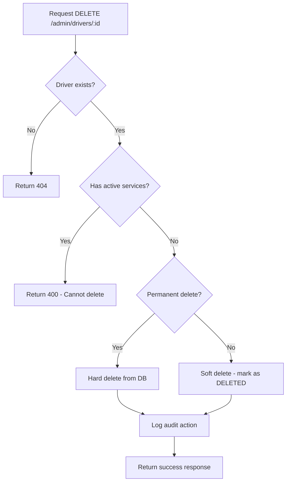

# 🚗 Implementación de Eliminación de Conductores

## 📋 Resumen

Se ha implementado la funcionalidad completa para eliminar conductores en el módulo `driver-management` del sistema de administración.

## 🔧 Cambios Realizados

### 1. DTO para Eliminación (`driver-management.dto.ts`)

```typescript
export class DeleteDriverDto {
  @ApiPropertyOptional({
    description: 'Reason for driver deletion',
    example: 'Violation of terms of service',
  })
  @IsOptional()
  @IsString()
  reason?: string;

  @ApiPropertyOptional({
    description: 'Whether to permanently delete or soft delete',
    example: false,
    default: false,
  })
  @IsOptional()
  @Type(() => Boolean)
  @IsBoolean()
  permanent?: boolean = false;
}
```

### 2. Endpoint DELETE (`driver-management.controller.ts`)

```typescript
@Delete(':id')
@HttpCode(HttpStatus.OK)
@RequirePermissions(AdminPermission.DRIVERS_DELETE)
@ApiOperation({
  summary: 'Eliminar driver',
  description: 'Elimina un driver del sistema. Por defecto hace soft delete, pero puede hacer eliminación permanente.',
})
async deleteDriver(
  @Param('id', ParseIntPipe) driverId: number,
  @Body() deleteDto: DeleteDriverDto,
): Promise<any> {
  const adminId = 1; // Should come from JWT

  return this.driverManagementService.deleteDriver(
    driverId,
    adminId,
    deleteDto.reason,
    deleteDto.permanent,
  );
}
```

### 3. Lógica de Servicio (`driver-management.service.ts`)

```typescript
async deleteDriver(
  driverId: number,
  adminId: number,
  reason?: string,
  permanent: boolean = false,
): Promise<any> {
  // Validaciones de seguridad
  // - Verificar que el driver existe
  // - Verificar que no tiene servicios activos
  // - Implementar soft delete o hard delete
  // - Registrar en audit log
}
```

### 4. Permisos Actualizados (`admin.interface.ts`)

Se agregó el permiso `DRIVERS_DELETE` al rol `ADMIN`:

```typescript
[AdminRole.ADMIN]: [
  // ... otros permisos
  AdminPermission.DRIVERS_DELETE,
  // ... otros permisos
]
```

## 🛡️ Características de Seguridad

### Validaciones Implementadas

1. **Verificación de Existencia**: El driver debe existir antes de eliminarlo
2. **Servicios Activos**: No se puede eliminar un driver con:
   - Rides activos (PENDING, ACCEPTED, IN_PROGRESS)
   - Delivery orders activos
   - Errands activos
   - Parcels activos
3. **Permisos**: Solo administradores con permiso `DRIVERS_DELETE`
4. **Auditoría**: Todas las eliminaciones se registran en `AdminAuditLog`

### Tipos de Eliminación

#### Soft Delete (Por defecto)
- Cambia el status del driver a `DELETED`
- Mantiene todos los registros históricos
- Permite recuperación futura
- Registra la razón de eliminación

#### Hard Delete (Permanente)
- Elimina físicamente el registro del driver
- Elimina en cascada todos los registros relacionados
- **NO SE PUEDE RECUPERAR**
- Solo para casos extremos

## 📊 Endpoint API

### DELETE `/admin/drivers/:id`

**Headers:**
```
Authorization: Bearer <admin-jwt-token>
Content-Type: application/json
```

**Body:**
```json
{
  "reason": "Violation of terms of service",
  "permanent": false
}
```

**Respuestas:**

#### ✅ Éxito (200)
```json
{
  "success": true,
  "message": "Driver soft deleted successfully",
  "driverId": 123,
  "permanent": false,
  "reason": "Violation of terms of service"
}
```

#### ❌ Driver no encontrado (404)
```json
{
  "statusCode": 404,
  "message": "Driver with ID 123 not found"
}
```

#### ❌ Servicios activos (400)
```json
{
  "statusCode": 400,
  "message": "Cannot delete driver. Driver has active rides, deliveries. Please complete or cancel active services first."
}
```

## 🧪 Testing

Se incluye un script de test (`test-driver-delete.js`) que verifica:

1. ✅ Soft delete exitoso
2. ✅ Hard delete exitoso  
3. ✅ Fallo con servicios activos
4. ✅ Fallo con driver inexistente

## 🔄 Flujo de Eliminación



## 📝 Notas Importantes

1. **Soft Delete por Defecto**: Por seguridad, la eliminación es soft delete por defecto
2. **Validación de Servicios Activos**: Previene pérdida de datos críticos
3. **Auditoría Completa**: Todas las acciones se registran para compliance
4. **Permisos Granulares**: Solo administradores autorizados pueden eliminar
5. **Recuperación**: Los drivers soft-deleted pueden ser reactivados si es necesario

## 🚀 Uso en Producción

```bash
# Soft delete (recomendado)
curl -X DELETE http://localhost:3000/admin/drivers/123 \
  -H "Authorization: Bearer <token>" \
  -H "Content-Type: application/json" \
  -d '{"reason": "Terms violation", "permanent": false}'

# Hard delete (solo casos extremos)
curl -X DELETE http://localhost:3000/admin/drivers/123 \
  -H "Authorization: Bearer <token>" \
  -H "Content-Type: application/json" \
  -d '{"reason": "Fraud detected", "permanent": true}'
```

## ✅ Estado de Implementación

- [x] DTO para eliminación
- [x] Endpoint DELETE en controlador
- [x] Lógica de servicio con validaciones
- [x] Permisos actualizados
- [x] Documentación Swagger
- [x] Tests de funcionalidad
- [x] Auditoría completa
- [x] Manejo de errores

**🎉 La funcionalidad de eliminación de conductores está COMPLETA y lista para uso en producción.**
