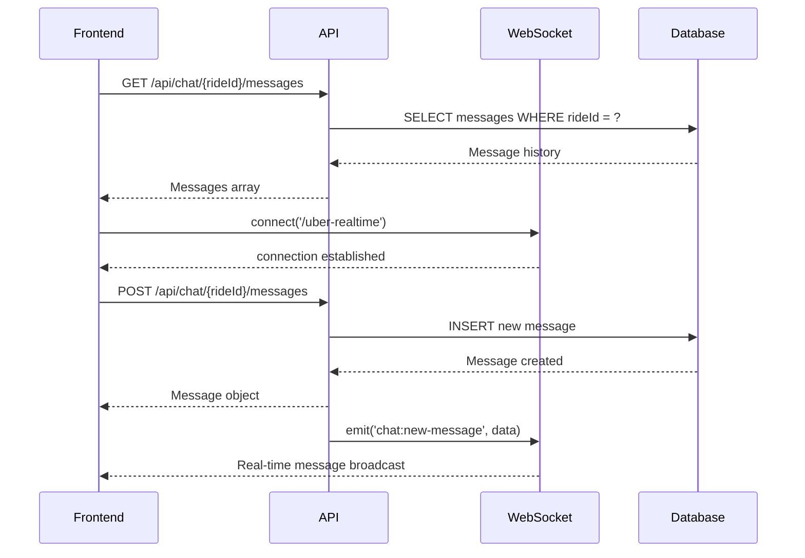
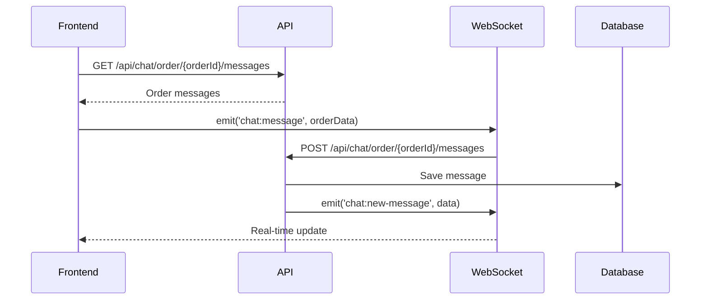

# 💬 Chat Module - Frontend Integration Guide

## 📋 Resumen

Este documento describe cómo integrar el módulo de chat desde el frontend. Incluye todas las consultas REST API, eventos WebSocket, y flujos de uso para implementar chat en tiempo real para viajes y deliveries.

---

## 🔗 API Endpoints

### Base URL
```
http://localhost:3000/api/chat
```

### Headers Requeridos
```javascript
const headers = {
  'Authorization': 'Bearer <JWT_TOKEN>',
  'Content-Type': 'application/json'
};
```

---

## 📨 1. Obtener Mensajes de un Viaje

### GET `/api/chat/{rideId}/messages`

**Propósito:** Obtener historial completo de mensajes para un viaje específico.

**Parámetros URL:**
- `rideId` (number): ID único del viaje

**Request:**
```javascript
const rideId = 123;
const response = await fetch(`http://localhost:3000/api/chat/${rideId}/messages`, {
  method: 'GET',
  headers: {
    'Authorization': `Bearer ${token}`,
    'Content-Type': 'application/json'
  }
});
```

**Response (200 - Success):**
```json
[
  {
    "id": 1,
    "rideId": 123,
    "senderId": "user_2abc123def456",
    "messageText": "Hola, voy en camino",
    "createdAt": "2024-01-15T10:30:00Z",
    "sender": {
      "id": 1,
      "name": "Juan Pérez",
      "profileImage": "https://example.com/image.jpg"
    }
  },
  {
    "id": 2,
    "rideId": 123,
    "senderId": "driver_789xyz",
    "messageText": "Perfecto, te espero en 5 minutos",
    "createdAt": "2024-01-15T10:32:00Z",
    "sender": {
      "id": 2,
      "name": "Carlos López",
      "profileImage": "https://example.com/driver.jpg"
    }
  }
]
```

**Response (403 - Forbidden):**
```json
{
  "statusCode": 403,
  "message": "Not authorized to view this ride chat"
}
```

**Response (404 - Not Found):**
```json
{
  "statusCode": 404,
  "message": "Ride not found"
}
```

---

## 📨 2. Obtener Mensajes de una Orden de Delivery

### GET `/api/chat/order/{orderId}/messages`

**Propósito:** Obtener historial de mensajes para una orden de delivery.

**Parámetros URL:**
- `orderId` (number): ID único de la orden de delivery

**Request:**
```javascript
const orderId = 456;
const response = await fetch(`http://localhost:3000/api/chat/order/${orderId}/messages`, {
  method: 'GET',
  headers: {
    'Authorization': `Bearer ${token}`,
    'Content-Type': 'application/json'
  }
});
```

**Response (200 - Success):**
```json
[
  {
    "id": 1,
    "orderId": 456,
    "senderId": "user_2abc123def456",
    "messageText": "¿Dónde está mi pedido?",
    "createdAt": "2024-01-15T14:30:00Z",
    "sender": {
      "id": 1,
      "name": "María García",
      "profileImage": "https://example.com/user.jpg"
    }
  },
  {
    "id": 2,
    "orderId": 456,
    "senderId": "courier_xyz789",
    "messageText": "Estoy a 10 minutos de tu ubicación",
    "createdAt": "2024-01-15T14:32:00Z",
    "sender": {
      "id": 3,
      "name": "Pedro Martínez",
      "profileImage": "https://example.com/courier.jpg"
    }
  }
]
```

---

## 📨 3. Enviar Mensaje en un Viaje

### POST `/api/chat/{rideId}/messages`

**Propósito:** Enviar un nuevo mensaje en el chat de un viaje.

**Parámetros URL:**
- `rideId` (number): ID único del viaje

**Request Body:**
```json
{
  "senderId": "user_2abc123def456",
  "messageText": "Estoy llegando al punto de recogida"
}
```

**Request:**
```javascript
const rideId = 123;
const messageData = {
  senderId: "user_2abc123def456",
  messageText: "Estoy llegando al punto de recogida"
};

const response = await fetch(`http://localhost:3000/api/chat/${rideId}/messages`, {
  method: 'POST',
  headers: {
    'Authorization': `Bearer ${token}`,
    'Content-Type': 'application/json'
  },
  body: JSON.stringify(messageData)
});
```

**Response (201 - Created):**
```json
{
  "id": 3,
  "rideId": 123,
  "senderId": "user_2abc123def456",
  "messageText": "Estoy llegando al punto de recogida",
  "createdAt": "2024-01-15T10:35:00Z",
  "sender": {
    "id": 1,
    "name": "Juan Pérez",
    "profileImage": "https://example.com/image.jpg"
  }
}
```

**Response (400 - Bad Request):**
```json
{
  "statusCode": 400,
  "message": [
    "senderId should not be empty",
    "messageText should not be empty"
  ],
  "error": "Bad Request"
}
```

**Response (403 - Forbidden):**
```json
{
  "statusCode": 403,
  "message": "Not authorized to send messages for this ride"
}
```

---

## 📨 4. Enviar Mensaje en una Orden de Delivery

### POST `/api/chat/order/{orderId}/messages`

**Propósito:** Enviar un mensaje en el chat de una orden de delivery.

**Parámetros URL:**
- `orderId` (number): ID único de la orden de delivery

**Request Body:** Identico al endpoint de viaje.

**Request:**
```javascript
const orderId = 456;
const messageData = {
  senderId: "user_2abc123def456",
  messageText: "Mi dirección es Calle Principal 123"
};

const response = await fetch(`http://localhost:3000/api/chat/order/${orderId}/messages`, {
  method: 'POST',
  headers: {
    'Authorization': `Bearer ${token}`,
    'Content-Type': 'application/json'
  },
  body: JSON.stringify(messageData)
});
```

---

## 📨 5. Obtener Todos los Mensajes de un Usuario

### GET `/api/chat/user/{userId}/messages`

**Propósito:** Obtener todos los mensajes enviados por un usuario específico.

**Parámetros URL:**
- `userId` (string): Clerk ID del usuario

**Request:**
```javascript
const userId = "user_2abc123def456";
const response = await fetch(`http://localhost:3000/api/chat/user/${userId}/messages`, {
  method: 'GET',
  headers: {
    'Authorization': `Bearer ${token}`,
    'Content-Type': 'application/json'
  }
});
```

**Response (200 - Success):**
```json
[
  {
    "id": 1,
    "rideId": 123,
    "orderId": null,
    "senderId": "user_2abc123def456",
    "messageText": "Hola, voy en camino",
    "createdAt": "2024-01-15T10:30:00Z",
    "sender": {
      "id": 1,
      "name": "Juan Pérez"
    }
  },
  {
    "id": 2,
    "rideId": null,
    "orderId": 456,
    "senderId": "user_2abc123def456",
    "messageText": "¿Dónde está mi pedido?",
    "createdAt": "2024-01-15T14:30:00Z",
    "sender": {
      "id": 1,
      "name": "Juan Pérez"
    }
  }
]
```

---

## 🔌 WebSocket - Mensajería en Tiempo Real

### Conexión WebSocket

**Namespace:** `/uber-realtime`
**URL:** `http://localhost:3000/uber-realtime`

**Conexión:**
```javascript
import io from 'socket.io-client';

const socket = io('http://localhost:3000/uber-realtime', {
  transports: ['websocket']
});
```

### Eventos de Conexión

**Conectar:**
```javascript
socket.on('connect', () => {
  console.log('Conectado al chat en tiempo real');
});
```

**Desconectar:**
```javascript
socket.on('disconnect', () => {
  console.log('Desconectado del chat');
});
```

### Enviar Mensaje por WebSocket

**Evento:** `chat:message`

**Payload:**
```javascript
socket.emit('chat:message', {
  rideId: 123,              // Para chats de viaje (opcional)
  orderId: null,            // Para chats de delivery (opcional)
  senderId: "user_2abc123def456",
  message: "Mensaje de prueba"
});
```

**Response del Servidor:**
```javascript
// El servidor confirma recepción
{ status: 'success', message: 'Message sent' }
```

### Escuchar Nuevos Mensajes

**Evento:** `chat:new-message`

**Payload Recibido:**
```javascript
socket.on('chat:new-message', (data) => {
  console.log('Nuevo mensaje:', data);
  /*
  data = {
    senderId: "user_2abc123def456",
    message: "Mensaje de prueba",
    timestamp: "2024-01-15T10:35:00Z",
    type: "ride" // o "order"
  }
  */
});
```

---

## 🔄 Flujos de Integración

### 1. Flujo para Chat de Viaje



### 2. Flujo para Chat de Delivery



### 3. Inicialización del Chat

```javascript
// 1. Cargar mensajes históricos
async function loadChatHistory(chatType, chatId) {
  const endpoint = chatType === 'ride'
    ? `/api/chat/${chatId}/messages`
    : `/api/chat/order/${chatId}/messages`;

  const response = await fetch(`${BASE_URL}${endpoint}`, {
    headers: { 'Authorization': `Bearer ${token}` }
  });

  return await response.json();
}

// 2. Conectar WebSocket
function connectWebSocket() {
  const socket = io('http://localhost:3000/uber-realtime');

  socket.on('connect', () => {
    console.log('Chat WebSocket connected');
  });

  socket.on('chat:new-message', handleNewMessage);

  return socket;
}

// 3. Enviar mensaje
async function sendMessage(chatType, chatId, messageData) {
  // Enviar por REST API
  const endpoint = chatType === 'ride'
    ? `/api/chat/${chatId}/messages`
    : `/api/chat/order/${chatId}/messages`;

  const response = await fetch(`${BASE_URL}${endpoint}`, {
    method: 'POST',
    headers: {
      'Authorization': `Bearer ${token}`,
      'Content-Type': 'application/json'
    },
    body: JSON.stringify(messageData)
  });

  // Broadcast por WebSocket
  socket.emit('chat:message', {
    [chatType === 'ride' ? 'rideId' : 'orderId']: chatId,
    senderId: messageData.senderId,
    message: messageData.messageText
  });

  return await response.json();
}
```

---

## 📊 Estructuras de Datos

### Message Object
```typescript
interface Message {
  id: number;
  rideId?: number;        // Para mensajes de viaje
  orderId?: number;       // Para mensajes de delivery
  senderId: string;       // Clerk ID del remitente
  messageText: string;    // Contenido del mensaje
  createdAt: string;      // Timestamp ISO
  sender: {               // Información del remitente
    id: number;
    name: string;
    profileImage?: string;
  };
}
```

### WebSocket Message DTO
```typescript
interface ChatMessageDto {
  rideId?: number;        // ID del viaje (mutually exclusive con orderId)
  orderId?: number;       // ID de la orden (mutually exclusive con rideId)
  senderId: string;       // Clerk ID del remitente
  message: string;        // Contenido del mensaje
}
```

### REST API Message DTO
```typescript
interface SendMessageDto {
  senderId: string;       // Clerk ID del remitente
  messageText: string;    // Contenido del mensaje (máx. 1000 chars)
}
```

---

## ⚠️ Consideraciones Técnicas

### Autenticación
- **Requerida:** Todos los endpoints necesitan JWT válido
- **Sender Validation:** El `senderId` debe corresponder al usuario autenticado
- **Authorization:** Solo participantes del viaje/orden pueden acceder

### Validaciones
- **Message Length:** Máximo 1000 caracteres
- **Required Fields:** `senderId` y `messageText` son obligatorios
- **Exclusive IDs:** Solo se permite `rideId` o `orderId`, no ambos

### WebSocket
- **Namespace:** `/uber-realtime`
- **Transports:** WebSocket preferido
- **Reconnection:** Automática en caso de desconexión
- **Rooms:** Mensajes se envían a rooms específicos (`ride-{id}` o `order-{id}`)

### Rate Limiting
- Implementar control de frecuencia en el frontend
- Evitar spam de mensajes consecutivos
- Manejar errores 429 (Too Many Requests)

### Error Handling
```javascript
// Manejo de errores comunes
const handleApiError = (error, status) => {
  switch (status) {
    case 400:
      console.error('Datos inválidos:', error.message);
      break;
    case 403:
      console.error('Sin permisos para este chat');
      break;
    case 404:
      console.error('Viaje u orden no encontrada');
      break;
    case 500:
      console.error('Error del servidor:', error.message);
      break;
    default:
      console.error('Error desconocido:', error);
  }
};
```

---

## 🔧 Casos de Uso Específicos

### Chat en Viaje Activo
1. **Cargar historial:** `GET /api/chat/{rideId}/messages`
2. **Conectar WebSocket:** Para mensajes en tiempo real
3. **Enviar mensajes:** `POST /api/chat/{rideId}/messages`
4. **Escuchar updates:** `chat:new-message`

### Chat en Delivery
1. **Cargar historial:** `GET /api/chat/order/{orderId}/messages`
2. **Conectar WebSocket:** Para comunicación con courier
3. **Enviar mensajes:** `POST /api/chat/order/{orderId}/messages`
4. **Tracking en tiempo real:** Ubicación del courier + chat

### Historial de Usuario
- **Todos los mensajes:** `GET /api/chat/user/{userId}/messages`
- **Útil para:** Soporte al cliente, moderación, analytics

---

## 🚀 Próximos Pasos

1. **Implementar autenticación JWT** en las requests
2. **Configurar WebSocket connection** con manejo de reconexión
3. **Crear state management** para mensajes
4. **Implementar UI components** basados en estas APIs
5. **Agregar error handling** y retry logic
6. **Implementar optimizaciones** (paginación, cache)

Esta documentación proporciona todas las consultas y flujos necesarios para integrar completamente el módulo de chat en cualquier aplicación frontend. 🎯
