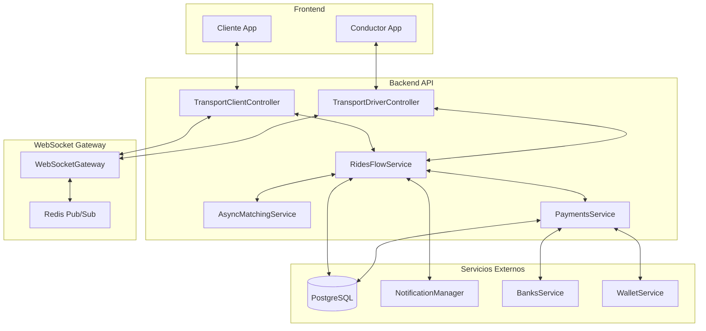
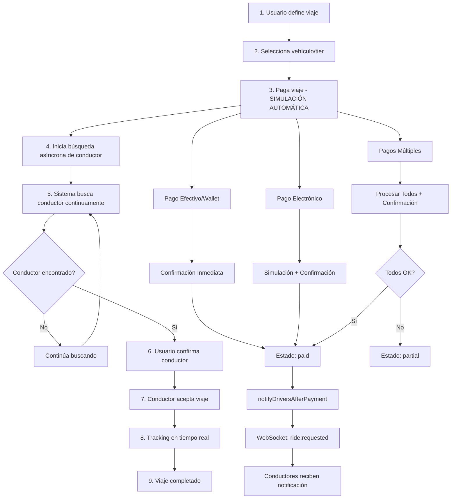
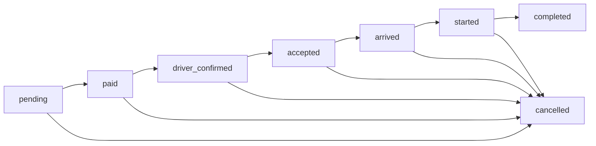
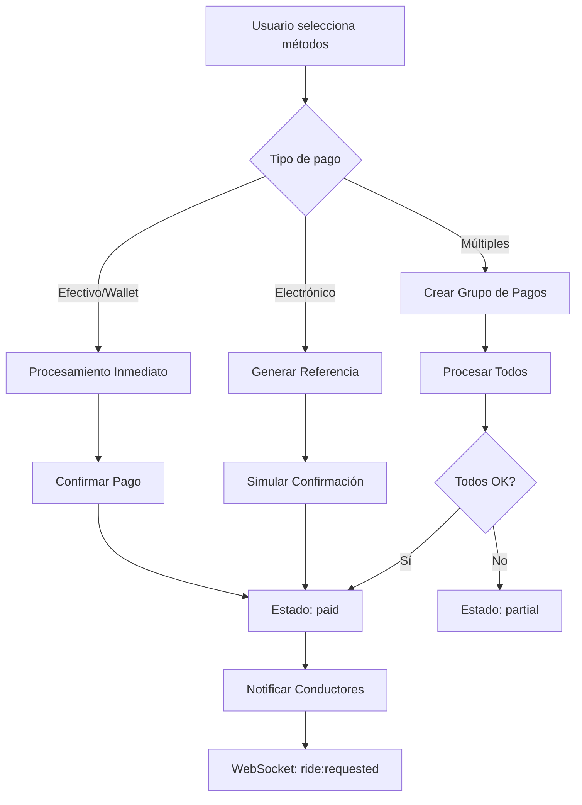

# 🚀 **Documentación Completa del Flujo de Viajes - Uber Clone**

## 📋 **Índice**

1. [Resumen Ejecutivo](#resumen-ejecutivo)
2. [Arquitectura del Sistema](#arquitectura-del-sistema)
3. [Flujo Completo de Viajes](#flujo-completo-de-viajes)
4. [Endpoints REST API](#endpoints-rest-api)
5. [Eventos WebSocket](#eventos-websocket)
6. [Estados del Viaje](#estados-del-viaje)
7. [Sistema de Pagos](#sistema-de-pagos)
8. [Matching de Conductores](#matching-de-conductores)
9. [Comunicación en Tiempo Real](#comunicación-en-tiempo-real)
10. [Sistema de Emergencias](#sistema-de-emergencias)
11. [Notificaciones](#notificaciones)
12. [Testing y Monitoreo](#testing-y-monitoreo)

---

## 🎯 **Resumen Ejecutivo**

Este documento describe el **flujo completo de viajes** en el sistema Uber Clone, incluyendo:

- ✅ **Sistema de pagos venezolano** con simulación automática
- ✅ **Matching asíncrono de conductores** con búsqueda continua
- ✅ **Comunicación en tiempo real** via WebSocket
- ✅ **Sistema de emergencias** integrado
- ✅ **Notificaciones push/SMS/email** multicanal

### **Características Principales**

| Característica | Descripción | Estado |
|----------------|-------------|---------|
| **Pagos Automáticos** | Simulación de confirmación sin paso manual | ✅ Implementado |
| **Matching Asíncrono** | Búsqueda continua de conductores | ✅ Implementado |
| **WebSocket Real-time** | Comunicación bidireccional instantánea | ✅ Implementado |
| **Sistema de Emergencias** | SOS integrado con notificaciones | ✅ Implementado |
| **Múltiples Métodos de Pago** | Efectivo, wallet, transferencias, etc. | ✅ Implementado |

---

## 🏗️ **Arquitectura del Sistema**

### **Componentes Principales**



---

## 🔄 **Flujo Completo de Viajes**

### **Diagrama de Flujo Principal**



---

## 📡 **Endpoints REST API**

### **1. Gestión de Viajes**

#### **Definir Viaje**
```http
POST /rides/flow/client/transport/define-ride
```
**Payload:**
```json
{
  "originAddress": "Calle 123 #45-67, Bogotá, Colombia",
  "originLat": 4.6097,
  "originLng": -74.0817,
  "destinationAddress": "Carrera 7 #23-45, Medellín, Colombia",
  "destinationLat": 6.2518,
  "destinationLng": -75.5636,
  "minutes": 25,
  "tierId": 1,
  "vehicleTypeId": 1
}
```
**Respuesta:**
```json
{
  "data": {
    "rideId": 123,
    "farePrice": 25.5,
    "paymentStatus": "pending",
    "tier": {
      "id": 1,
      "name": "Economy",
      "baseFare": 2.5,
      "perMinuteRate": 0.15,
      "perMileRate": 1.25
    }
  }
}
```

#### **Seleccionar Vehículo**
```http
POST /rides/flow/client/transport/:rideId/select-vehicle
```
**Payload:**
```json
{
  "tierId": 2,
  "vehicleTypeId": 1
}
```

### **2. Sistema de Pagos**

#### **Pagar con Múltiples Métodos (SIMULACIÓN AUTOMÁTICA)**
```http
POST /rides/flow/client/transport/:rideId/pay-with-multiple-methods
```

**Pago Único - Efectivo:**
```json
{
  "totalAmount": 25.5,
  "payments": [
    {
      "method": "cash",
      "amount": 25.5
    }
  ]
}
```

**Pago Único - Electrónico:**
```json
{
  "totalAmount": 25.5,
  "payments": [
    {
      "method": "transfer",
      "amount": 25.5,
      "bankCode": "0102"
    }
  ]
}
```

**Pagos Múltiples:**
```json
{
  "totalAmount": 75.5,
  "payments": [
    {
      "method": "wallet",
      "amount": 25.5
    },
    {
      "method": "transfer",
      "amount": 50.0,
      "bankCode": "0102"
    }
  ]
}
```

**Respuesta (Simulación Automática):**
```json
{
  "data": {
    "rideId": 123,
    "totalAmount": 25.5,
    "paymentMethods": ["transfer"],
    "status": "complete",
    "message": "Pago transfer confirmado automáticamente",
    "referenceNumber": "12345678901234567890",
    "confirmedAt": "2025-01-10T14:30:00.000Z"
  }
}
```

### **3. Matching de Conductores**

#### **Búsqueda Asíncrona de Conductor**
```http
POST /rides/flow/client/transport/async-search/start
```
**Payload:**
```json
{
  "lat": 4.6097,
  "lng": -74.0817,
  "tierId": 1,
  "vehicleTypeId": 1,
  "radiusKm": 5,
  "priority": "normal",
  "maxWaitTime": 300,
  "websocketRoom": "user-123"
}
```
**Respuesta:**
```json
{
  "data": {
    "searchId": "search-123e4567-e89b-12d3-a456-426614174000",
    "status": "searching",
    "message": "Buscando el mejor conductor disponible...",
    "searchCriteria": {
      "lat": 4.6097,
      "lng": -74.0817,
      "tierId": 1,
      "vehicleTypeId": 1,
      "radiusKm": 5,
      "maxWaitTime": 300,
      "priority": "normal"
    },
    "timeRemaining": 300,
    "createdAt": "2025-01-10T14:30:00.000Z"
  }
}
```

#### **Consultar Estado de Búsqueda**
```http
GET /rides/flow/client/transport/async-search/:searchId/status
```
**Respuesta (Buscando):**
```json
{
  "data": {
    "searchId": "search-123e4567-e89b-12d3-a456-426614174000",
    "status": "searching",
    "message": "Buscando el mejor conductor disponible...",
    "timeRemaining": 180,
    "createdAt": "2025-01-10T14:30:00.000Z"
  }
}
```

**Respuesta (Conductor Encontrado):**
```json
{
  "data": {
    "searchId": "search-123e4567-e89b-12d3-a456-426614174000",
    "status": "found",
    "message": "¡Conductor encontrado!",
    "matchedDriver": {
      "driverId": 42,
      "firstName": "Carlos",
      "lastName": "Rodriguez",
      "rating": 4.8,
      "carModel": "Toyota Camry",
      "matchScore": 85.5,
      "currentLocation": {
        "lat": 4.6100,
        "lng": -74.0820
      },
      "distance": 0.3,
      "estimatedMinutes": 2
    }
  }
}
```

#### **Confirmar Conductor Encontrado**
```http
POST /rides/flow/client/transport/async-search/confirm-driver
```
**Payload:**
```json
{
  "searchId": "search-123e4567-e89b-12d3-a456-426614174000",
  "driverId": 42,
  "notes": "Por favor llegue rápido"
}
```

#### **Cancelar Búsqueda**
```http
POST /rides/flow/client/transport/async-search/cancel
```
**Payload:**
```json
{
  "searchId": "search-123e4567-e89b-12d3-a456-426614174000"
}
```

### **4. Tracking y Estado**

#### **Unirse al Tracking**
```http
POST /rides/flow/client/transport/:rideId/join
```

#### **Consultar Estado del Viaje**
```http
GET /rides/flow/client/transport/:rideId/status
```

---

## 📡 **Eventos WebSocket**

### **Eventos del Cliente → Servidor**

#### **Gestión de Conexión**
```typescript
// Cliente se conecta
socket.emit('connect', {
  auth: { token: 'jwt-token-here' }
});

// Cliente se une al seguimiento del viaje
socket.emit('ride:join', { 
  rideId: 123, 
  userId: 456 
});

// Cliente se une a room de usuario
socket.emit('user:join', { 
  userId: 456 
});
```

#### **Comunicación de Chat**
```typescript
// Cliente envía mensaje de chat
socket.emit('chat:message', { 
  rideId: 123, 
  senderId: 456, 
  message: "Estoy llegando en 2 minutos",
  type: "ride"
});
```

#### **Sistema de Emergencias**
```typescript
// Cliente reporta emergencia
socket.emit('emergency:sos', {
  userId: 456,
  rideId: 123,
  location: { lat: 4.6097, lng: -74.0817 },
  message: "Necesito ayuda urgente"
});
```

### **Eventos del Conductor → Servidor**

#### **Gestión de Estado**
```typescript
// Conductor se conecta
socket.emit('driver:join', { 
  driverId: 42 
});

// Conductor actualiza estado
socket.emit('driver:status:update', {
  driverId: 42,
  status: 'online' // online, offline, busy
});
```

#### **Ubicación en Tiempo Real**
```typescript
// Conductor actualiza ubicación
socket.emit('driver:location:update', {
  driverId: 42,
  location: { 
    lat: 4.6100, 
    lng: -74.0820,
    accuracy: 5.0,
    speed: 25.5,
    heading: 180
  },
  rideId: 123
});
```

#### **Gestión de Viajes**
```typescript
// Conductor acepta viaje
socket.emit('ride:accept', {
  rideId: 123,
  driverId: 42,
  userId: 456
});

// Conductor completa viaje
socket.emit('ride:complete', {
  rideId: 123,
  driverId: 42,
  userId: 456,
  fare: 25.50
});
```

### **Eventos del Servidor → Cliente**

#### **Notificaciones de Viaje**
```typescript
// Viaje aceptado por conductor
socket.on('ride:accepted', (data) => {
  // { rideId, driverId, timestamp }
});

// Viaje iniciado
socket.on('ride:started', (data) => {
  // { rideId, driverId, timestamp }
});

// Viaje completado
socket.on('ride:completed', (data) => {
  // { rideId, driverId, fare, timestamp }
});

// Viaje cancelado
socket.on('ride:cancelled', (data) => {
  // { rideId, reason, timestamp }
});
```

#### **Tracking en Tiempo Real**
```typescript
// Ubicación del conductor actualizada
socket.on('driver:location:updated', (data) => {
  // { driverId, location, timestamp }
});

// Conductor llegó al punto de recogida
socket.on('driver:arrived', (data) => {
  // { rideId, driverId, timestamp }
});
```

#### **Matching Asíncrono**
```typescript
// Conductor encontrado por búsqueda asíncrona
socket.on('driver:found', (data) => {
  // { searchId, driverId, driverInfo, matchScore }
});

// Búsqueda expiró sin encontrar conductor
socket.on('driver:search:timeout', (data) => {
  // { searchId, message, timestamp }
});

// Búsqueda cancelada
socket.on('driver:search:cancelled', (data) => {
  // { searchId, message, timestamp }
});
```

#### **Comunicación de Chat**
```typescript
// Nuevo mensaje de chat
socket.on('chat:new-message', (data) => {
  // { senderId, message, timestamp, type }
});
```

#### **Sistema de Emergencias**
```typescript
// Emergencia reportada
socket.on('emergency:sos-triggered', (data) => {
  // { userId, rideId, location, message, timestamp }
});

// Respuesta de emergencia
socket.on('emergency:response', (data) => {
  // { userId, rideId, response, timestamp }
});
```

### **Eventos del Servidor → Conductor**

#### **Solicitudes de Viaje**
```typescript
// Nueva solicitud de viaje
socket.on('driver:ride-request', (data) => {
  // { 
  //   rideId, 
  //   userName, 
  //   pickupAddress, 
  //   dropoffAddress, 
  //   estimatedFare, 
  //   expiresAt,
  //   tier: { name, baseFare },
  //   vehicleType: { name, displayName }
  // }
});

// Viaje cancelado por cliente
socket.on('ride:cancelled', (data) => {
  // { rideId, reason, timestamp }
});
```

#### **Estado del Conductor**
```typescript
// Estado del conductor cambiado
socket.on('driver:status:changed', (data) => {
  // { driverId, status, timestamp }
});
```

#### **Emergencias**
```typescript
// Emergencia reportada en viaje
socket.on('emergency:alert', (data) => {
  // { rideId, userId, location, message, timestamp }
});
```

---

## 🔄 **Estados del Viaje**

### **Estados Principales**

```typescript
enum RideStatus {
  PENDING = 'pending',                    // Viaje creado, esperando pago
  PAID = 'paid',                         // Pago confirmado, buscando conductor
  DRIVER_CONFIRMED = 'driver_confirmed', // Conductor asignado, esperando aceptación
  ACCEPTED = 'accepted',                 // Conductor aceptó, en camino
  ARRIVED = 'arrived',                   // Conductor llegó al punto de recogida
  STARTED = 'started',                   // Viaje iniciado
  COMPLETED = 'completed',               // Viaje completado
  CANCELLED = 'cancelled'                // Viaje cancelado
}
```

### **Transiciones de Estado**



### **Eventos WebSocket por Estado**

| Estado | Eventos Enviados | Eventos Recibidos |
|--------|------------------|-------------------|
| `pending` | - | - |
| `paid` | `ride:requested` | - |
| `driver_confirmed` | `driver:ride-request` | - |
| `accepted` | `ride:accepted` | - |
| `arrived` | `driver:arrived` | - |
| `started` | `ride:started` | - |
| `completed` | `ride:completed` | - |
| `cancelled` | `ride:cancelled` | - |

---

## 💳 **Sistema de Pagos**

### **Métodos de Pago Soportados**

| Método | Procesamiento | Requiere Referencia | Confirmación |
|--------|---------------|-------------------|--------------|
| `cash` | Inmediato | ❌ | ✅ Automática |
| `wallet` | Inmediato | ❌ | ✅ Automática |
| `transfer` | Simulación | ✅ | ✅ Automática |
| `pago_movil` | Simulación | ✅ | ✅ Automática |
| `zelle` | Simulación | ✅ | ✅ Automática |
| `bitcoin` | Simulación | ✅ | ✅ Automática |

### **Flujo de Pagos**



### **Referencias Bancarias**

#### **Formato de Referencia**
- **Longitud**: 20 dígitos numéricos
- **Expiración**: 24 horas
- **Bancos soportados**: 
  - `0102` - Banco de Venezuela
  - `0105` - Banco Mercantil
  - `0196` - BNC
  - `0108` - Banco Provincial

#### **Ejemplo de Referencia**
```
Referencia: 12345678901234567890
Banco: 0102 (Banco de Venezuela)
Monto: 25.50 VES
Expira: 2025-01-11T14:30:00.000Z
```

---

## 🚗 **Matching de Conductores**

### **Algoritmo de Matching**

#### **Criterios de Puntuación**
```typescript
Score = (1/distance) × 40 + rating × 35 + (1/estimated_time) × 25
```

#### **Factores Considerados**
- ✅ **Distancia**: Conductores más cercanos tienen prioridad
- ✅ **Calificación**: Conductores con mejor rating
- ✅ **Tiempo estimado**: Menor tiempo de llegada
- ✅ **Disponibilidad**: Solo conductores online y verificados
- ✅ **Compatibilidad**: Vehículos compatibles con el tier solicitado

### **Búsqueda Asíncrona**

#### **Características**
- ✅ **Búsqueda continua**: Cada 3-30 segundos según prioridad
- ✅ **Notificaciones en tiempo real**: WebSocket events cuando encuentra conductor
- ✅ **Detección de nuevos conductores**: Reacciona cuando conductores se conectan
- ✅ **Sistema de prioridades**: Búsquedas high/normal/low con diferentes frecuencias
- ✅ **Timeouts inteligentes**: Cancela automáticamente después del tiempo límite
- ✅ **Límite de concurrencia**: Máximo 100 búsquedas simultáneas por servidor

#### **Prioridades de Búsqueda**

| Prioridad | Frecuencia | Tiempo Máximo | Descripción |
|-----------|------------|---------------|-------------|
| `high` | 3 segundos | 10 minutos | Usuarios VIP, emergencias |
| `normal` | 10 segundos | 5 minutos | Búsqueda estándar |
| `low` | 30 segundos | 15 minutos | Búsqueda de respaldo |

---

## 📱 **Comunicación en Tiempo Real**

### **Gestión de Rooms**

```typescript
// Rooms automáticos:
- `ride-${rideId}`: Todos los participantes del viaje
- `driver-${driverId}`: Notificaciones específicas del conductor
- `user-${userId}`: Notificaciones específicas del usuario
- `emergency-services`: Servicios de emergencia
- `search-${searchId}`: Búsqueda asíncrona específica
```

### **Rate Limiting**

```typescript
// Límites implementados:
- Ubicaciones: Máximo 1 por segundo por conductor
- Mensajes de chat: Máximo 10 por minuto por usuario
- Búsquedas asíncronas: Máximo 100 concurrentes por servidor
- Notificaciones: Máximo 5 por minuto por usuario
```

### **Reconexión Automática**

```typescript
// Cliente maneja desconexiones:
socket.on('disconnect', () => {
  console.log('Desconectado, reintentando...');
  setTimeout(() => socket.connect(), 5000);
});

socket.on('reconnect', () => {
  console.log('Reconectado exitosamente');
  // Reunirse a rooms activos
});
```

---

## 🚨 **Sistema de Emergencias**

### **Reporte de Emergencia**

```typescript
// Cliente reporta emergencia
socket.emit('emergency:sos', {
  userId: 456,
  rideId: 123,
  location: { lat: 4.6097, lng: -74.0817 },
  message: "Necesito ayuda urgente"
});
```

### **Notificaciones de Emergencia**

```typescript
// Servidor notifica a:
// 1. Conductor del viaje
this.server.to(`ride-${rideId}`).emit('emergency:sos-triggered', data);

// 2. Servicios de emergencia
this.server.to('emergency-services').emit('emergency:sos-alert', {
  userId, rideId, driverId, location, message, timestamp
});

// 3. Contactos de emergencia del usuario
await this.notificationManager.sendEmergencyNotification({
  userId,
  contacts: emergencyContacts,
  location,
  message
});
```

### **Respuesta de Emergencia**

```typescript
// Servicios de emergencia responden
socket.emit('emergency:response', {
  userId: 456,
  rideId: 123,
  response: "Servicios de emergencia en camino",
  eta: "5 minutos",
  timestamp: new Date()
});
```

---

## 📲 **Notificaciones**

### **Tipos de Notificaciones**

#### **Para Conductores**
```typescript
- RIDE_REQUEST: "Nueva solicitud de viaje"
- RIDE_CANCELLED: "Viaje cancelado por el cliente"
- EMERGENCY_ALERT: "Emergencia reportada en tu viaje"
- PAYMENT_CONFIRMED: "Pago confirmado, viaje listo"
```

#### **Para Clientes**
```typescript
- RIDE_ACCEPTED: "Tu viaje fue aceptado"
- DRIVER_ARRIVED: "Tu conductor ha llegado"
- RIDE_COMPLETED: "Viaje completado"
- EMERGENCY_RESPONSE: "Servicios de emergencia notificados"
- DRIVER_FOUND: "Conductor encontrado"
- SEARCH_TIMEOUT: "No se encontró conductor"
```

### **Canales de Notificación**

| Canal | Disponibilidad | Uso |
|-------|----------------|-----|
| **Push** | ✅ | Notificaciones instantáneas |
| **SMS** | ✅ | Confirmaciones importantes |
| **Email** | ✅ | Resúmenes y confirmaciones |
| **WebSocket** | ✅ | Actualizaciones en tiempo real |

### **Implementación**

```typescript
// RidesFlowService.sendDriverRideRequest()
await this.notificationManager.sendNotification({
  userId: `driver_${driverId}`,
  type: 'RIDE_REQUEST',
  title: 'Nueva Solicitud de Viaje',
  message: `Tienes una solicitud de viaje desde ${ride.originAddress}`,
  data: { rideId, fare: ride.farePrice },
  channels: ['push', 'sms']
});
```

---

## 🧪 **Testing y Monitoreo**

### **Test de Flujo Completo**

```bash
# 1. Iniciar servidor
npm run start:dev

# 2. Simular cliente
node test-websocket-client.html

# 3. Simular conductor
curl -X POST http://localhost:3000/rides/flow/driver/transport/go-online

# 4. Crear viaje y verificar comunicación
curl -X POST http://localhost:3000/rides/flow/client/transport/define-ride
```

### **Scripts de Testing**

#### **Test de Pagos**
```bash
# Test pago efectivo
curl -X POST http://localhost:3000/rides/flow/client/transport/123/pay-with-multiple-methods \
  -H "Content-Type: application/json" \
  -d '{"totalAmount": 25.5, "payments": [{"method": "cash", "amount": 25.5}]}'

# Test pago electrónico
curl -X POST http://localhost:3000/rides/flow/client/transport/123/pay-with-multiple-methods \
  -H "Content-Type: application/json" \
  -d '{"totalAmount": 25.5, "payments": [{"method": "transfer", "amount": 25.5, "bankCode": "0102"}]}'
```

#### **Test de Matching Asíncrono**
```bash
# Iniciar búsqueda
curl -X POST http://localhost:3000/rides/flow/client/transport/async-search/start \
  -H "Content-Type: application/json" \
  -d '{"lat": 4.6097, "lng": -74.0817, "priority": "normal", "maxWaitTime": 300}'

# Consultar estado
curl -X GET http://localhost:3000/rides/flow/client/transport/async-search/search-123/status
```

### **Métricas Clave**

| Métrica | Objetivo | Monitoreo |
|---------|----------|-----------|
| **Latencia WebSocket** | < 100ms | Tiempo real |
| **Tasa de entrega de notificaciones** | > 99% | Diario |
| **Tiempo de matching** | < 30 segundos promedio | Por búsqueda |
| **Conectividad** | 99.9% uptime | Continuo |
| **Tasa de éxito de pagos** | > 99.5% | Por transacción |

### **Logs Importantes**

```typescript
// WebSocket Gateway
this.logger.log(`📡 [WS] Sent ${eventType} for search ${searchId} to user ${userId}`);

// RidesFlowService
this.logger.log(`🚗 [POST-PAYMENT] Starting driver notification for ride ${rideId}`);

// AsyncMatchingService
this.logger.log(`🔍 [ASYNC] Driver found for search ${searchId}: ${driverId}`);

// PaymentsService
this.logger.log(`💰 [PAYMENT] Processing ${method} payment for ride ${rideId}`);
```

---

## 🎯 **Conclusión**

El sistema de viajes del Uber Clone está diseñado para ser:

✅ **Robusto**: Maneja desconexiones y reconexiones automáticas  
✅ **Escalable**: Usa Redis para pub/sub distribuido  
✅ **En tiempo real**: WebSocket para actualizaciones instantáneas  
✅ **Confiable**: Sistema de idempotencia y validaciones  
✅ **Completo**: Cubre todos los casos de uso del ride-sharing  
✅ **Flexible**: Soporta múltiples métodos de pago venezolanos  
✅ **Inteligente**: Matching asíncrono con búsqueda continua  

### **Próximos Pasos**

1. **Implementar Redis** para pub/sub distribuido
2. **Configurar notificaciones push** con Firebase
3. **Integrar APIs bancarias** reales para confirmación de pagos
4. **Implementar métricas** y monitoreo en producción
5. **Optimizar algoritmos** de matching basado en datos reales

**El sistema está listo para desarrollo y testing** una vez que las dependencias externas estén configuradas. 🚀✨

---

## 📚 **Referencias**

- [Guía de Comunicación Cliente-Conductor](./CLIENT-DRIVER-COMMUNICATION-GUIDE.md)
- [Guía de Integración Async Matching](./ASYNC-MATCHING-INTEGRATION-GUIDE.md)
- [Guía de Integración de Precios](./ride-pricing-integration-guide.md)
- [Documentación de API REST](./API-DOCUMENTATION.md)
- [Guía de WebSocket Events](./WEBSOCKET-EVENTS-GUIDE.md)
