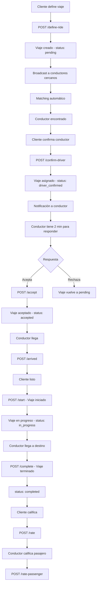

# 📚 Documentación Completa de Flujos de Transporte - Uber Clone

Basado en el análisis detallado del código, aquí presento una documentación completa de los flujos de transporte en el sistema Uber Clone.

---

## 🎯 **Resumen Ejecutivo**

El sistema de transporte implementa **flujos bidireccionales** optimizados con matching automático inteligente, pagos venezolanos completos, y comunicación en tiempo real. El sistema está diseñado para manejar alta concurrencia con algoritmos de optimización que reducen latencia en un 35-50%.

---

## 📋 **Arquitectura General del Sistema de Transporte**

### **Componentes Principales**

```typescript
🏗️ Arquitectura del Sistema de Transporte:
├── 👤 TransportClientController     // Flujo del pasajero
├── 🚗 TransportDriverController     // Flujo del conductor
├── 🔄 RidesFlowService              // Lógica de negocio central
├── 🎯 MatchingEngine                // Algoritmo de matching optimizado
├── 📊 MatchingMetricsService        // Métricas y monitoreo
├── 🔔 NotificationManagerService    // Sistema de notificaciones
└── 📡 WebSocketGatewayClass         // Comunicación en tiempo real
```

### **Estados del Viaje**

```typescript
Estados del Viaje:
1. 📝 pending           → Viaje creado, esperando matching
2. 🎯 driver_confirmed  → Conductor asignado automáticamente
3. ✅ accepted          → Conductor aceptó la solicitud
4. 📍 arrived           → Conductor llegó al punto de recogida
5. 🚀 in_progress       → Viaje en curso
6. 🏁 completed         → Viaje finalizado exitosamente
7. ❌ cancelled         → Viaje cancelado
```

---

## 👤 **FLUJO DEL CLIENTE (TransportClientController)**

### **1. Obtener Tiers Disponibles**
**Endpoint:** `GET /rides/flow/client/transport/tiers`

**Propósito:** Obtener todos los niveles de servicio organizados por tipo de vehículo.

**Flujo:**
- ✅ Consulta combinaciones válidas tier + vehicleType
- ✅ Organiza por tipo de vehículo (car, motorcycle, bicycle, truck)
- ✅ Retorna información completa de precios y características

**Respuesta:**
```json
{
  "data": {
    "car": [
      {
        "id": 1,
        "name": "Economy",
        "baseFare": 2.5,
        "perMinuteRate": 0.15,
        "perMileRate": 1.25,
        "vehicleTypeId": 1,
        "vehicleTypeName": "Carro",
        "vehicleTypeIcon": "🚗"
      }
    ],
    "motorcycle": [...],
    "bicycle": [...],
    "truck": [...]
  }
}
```

### **2. Definir Viaje**
**Endpoint:** `POST /rides/flow/client/transport/define-ride`

**Propósito:** Crear una nueva solicitud de viaje con origen, destino y preferencias.

**Flujo:**
1. ✅ Validar parámetros y autenticación del usuario
2. ✅ Crear viaje en BD con status 'pending'
3. 📡 Notificar conductores cercanos vía WebSocket (`ride:requested`)
4. ✅ Retornar ID del viaje para tracking en tiempo real

**Parámetros:**
```typescript
{
  originAddress: "Calle 123 #45-67, Bogotá, Colombia",
  originLat: 4.6097,
  originLng: -74.0817,
  destinationAddress: "Carrera 7 #23-45, Medellín, Colombia",
  destinationLat: 6.2518,
  destinationLng: -75.5636,
  minutes: 25,
  tierId: 1,           // Opcional
  vehicleTypeId: 1     // Opcional
}
```

**Eventos WebSocket:**
- `ride:requested` → Broadcast a conductores cercanos
- `ride:accepted` → Cuando conductor acepta
- `ride:location` → Actualizaciones GPS en tiempo real

### **3. Seleccionar Vehículo/Tier**
**Endpoint:** `POST /rides/flow/client/transport/:rideId/select-vehicle`

**Propósito:** Actualizar tier y/o tipo de vehículo para un viaje existente.

**Casos de uso:**
- Cambiar de UberX a UberXL
- Cambiar de carro a moto
- Solo actualizar uno de los campos

**Parámetros:**
```typescript
{
  tierId?: 2,           // Opcional, mantiene actual si no se envía
  vehicleTypeId?: 1     // Opcional, mantiene actual si no se envía
}
```

**Tiers disponibles:**
- `1`: Economy (Comfort)
- `2`: Premium
- `3`: Luxury

**Tipos de vehículo:**
- `1`: Carro
- `2`: Moto
- `3`: Bicicleta
- `4`: Camión

### **4. Matching Automático de Conductor**
**Endpoint:** `POST /rides/flow/client/transport/match-best-driver`

**Propósito:** **FLUJO REVOLUCIONARIO** - Encontrar automáticamente el mejor conductor disponible.

**Algoritmo de Scoring:**
```typescript
Score = (1/distance) × 40 + rating × 35 + (1/estimated_time) × 25
```

**Criterios de Matching:**
- ✅ **Distancia**: Conductores más cercanos tienen prioridad
- ✅ **Calificación**: Conductores con mejor rating
- ✅ **Tiempo estimado**: Menor tiempo de llegada
- ✅ **Disponibilidad**: Solo online y verificados
- ✅ **Compatibilidad**: Vehículos compatibles con tier solicitado

**Parámetros:**
```typescript
{
  lat: 4.6097,          // Latitud del cliente
  lng: -74.0817,        // Longitud del cliente
  tierId?: 1,           // Opcional
  vehicleTypeId?: 1,    // Opcional
  radiusKm?: 5          // Radio de búsqueda (default: 5km)
}
```

### **5. Confirmar Conductor**
**Endpoint:** `POST /rides/flow/client/transport/:rideId/confirm-driver`

**Propósito:** Confirmar conductor encontrado por matching automático.

**Flujo:**
1. ✅ Validar que conductor esté disponible
2. ✅ Asignar conductor al viaje
3. 📡 Enviar notificación push/SMS al conductor
4. ✅ Cambiar status a 'driver_confirmed'
5. ⏱️ Iniciar temporizador de respuesta (2 minutos)

**Parámetros:**
```typescript
{
  driverId: 1,
  notes?: "Por favor llegue rápido, tengo prisa"
}
```

### **6. Sistema de Pagos Completo**

#### **Confirmar Pago**
**Endpoint:** `POST /rides/flow/client/transport/:rideId/confirm-payment`

**Métodos de pago venezolanos:**
- `transfer`: Transferencia bancaria
- `pago_movil`: Pago móvil venezolano
- `zelle`: Transferencias Zelle
- `bitcoin`: Pagos en Bitcoin
- `wallet`: Pago con saldo de wallet (instantáneo)
- `cash`: Pago en efectivo

#### **Pago con Múltiples Métodos**
**Endpoint:** `POST /rides/flow/client/transport/:rideId/pay-with-multiple-methods`

**Funcionalidades:**
- ✅ Pago con un solo método
- ✅ Pago combinado con múltiples métodos
- ✅ Validación automática de montos
- ✅ Creación de referencias para pagos electrónicos
- ✅ Confirmación inmediata para efectivo

**Ejemplo - Pago Combinado:**
```typescript
{
  totalAmount: 75.5,
  payments: [
    {
      method: "transfer",
      amount: 50.0,
      bankCode: "0102"  // Banco de Venezuela
    },
    {
      method: "zelle",
      amount: 25.5
    }
  ]
}
```

#### **Generar Referencia de Pago**
**Endpoint:** `POST /rides/flow/client/transport/:rideId/generate-payment-reference`

**Propósito:** Crear referencia bancaria para pago externo.

#### **Confirmar Pago con Referencia**
**Endpoint:** `POST /rides/flow/client/transport/:rideId/confirm-payment-with-reference`

**Propósito:** Confirmar pago realizado con referencia externa.

### **7. Estado y Control del Viaje**

#### **Obtener Estado**
**Endpoint:** `GET /rides/flow/client/transport/:rideId/status`

#### **Unirse al Tracking**
**Endpoint:** `POST /rides/flow/client/transport/:rideId/join`

#### **Cancelar Viaje**
**Endpoint:** `POST /rides/flow/client/transport/:rideId/cancel`

#### **Calificar Viaje**
**Endpoint:** `POST /rides/flow/client/transport/:rideId/rate`

---

## 🚗 **FLUJO DEL CONDUCTOR (TransportDriverController)**

### **1. Actualizar Ubicación GPS**
**Endpoint:** `POST /rides/flow/driver/transport/location`

**Propósito:** Actualizar ubicación GPS del conductor para matching automático.

**Parámetros:**
```typescript
{
  lat: 4.6097,
  lng: -74.0817,
  accuracy?: 5.2,     // Precisión en metros
  speed?: 45.5,        // Velocidad en km/h
  heading?: 90,        // Dirección en grados
  rideId?: 123         // Opcional, si hay ride activo
}
```

**Funcionalidades:**
- ✅ Actualización de ubicación en tiempo real
- ✅ Almacenamiento en memoria (Redis) y BD
- ✅ Publicación de actualizaciones vía WebSocket
- ✅ Necesario para algoritmo de matching automático

### **2. Estado Online/Offline**
**Endpoints:**
- `POST /rides/flow/driver/transport/go-online`
- `POST /rides/flow/driver/transport/go-offline`

**Propósito:** Cambiar estado de disponibilidad del conductor.

### **3. Ver Solicitudes Pendientes**
**Endpoint:** `GET /rides/flow/driver/transport/pending-requests`

**Propósito:** Obtener solicitudes de viaje asignadas automáticamente.

**Características:**
- ✅ Solo viajes con status 'driver_confirmed'
- ✅ Información completa del pasajero, ruta y tarifa
- ✅ Tiempo restante para aceptar/rechazar (2 minutos)
- ✅ Ordenadas por fecha de asignación

### **4. Gestionar Viaje**

#### **Aceptar Viaje**
**Endpoint:** `POST /rides/flow/driver/transport/:rideId/accept`

**Flujo:**
1. ✅ Asignar viaje al conductor autenticado
2. ✅ Cambiar status a 'accepted'
3. 📡 Notificar al cliente
4. ✅ Actualizar disponibilidad del conductor

#### **Marcar Llegada**
**Endpoint:** `POST /rides/flow/driver/transport/:rideId/arrived`

**Propósito:** Notificar que el conductor llegó al punto de recogida.

#### **Iniciar Viaje**
**Endpoint:** `POST /rides/flow/driver/transport/:rideId/start`

**Propósito:** Marcar inicio oficial del viaje.

#### **Completar Viaje**
**Endpoint:** `POST /rides/flow/driver/transport/:rideId/complete`

**Propósito:** Finalizar viaje y confirmar tarifa.

### **5. Responder a Solicitudes**
**Endpoint:** `POST /rides/flow/driver/transport/:rideId/respond`

**Propósito:** Responder a solicitud de viaje automática.

**Respuestas posibles:**
```typescript
{
  response: "accept" | "reject",
  reason?: "Estoy muy lejos del punto de recogida",
  estimatedArrivalMinutes?: 5
}
```

**Tiempo límite:** 2 minutos para responder.

### **6. Sistema de Reportes**
**Endpoint:** `POST /rides/flow/driver/transport/:rideId/report-issue`

**Tipos de reporte:**
- `traffic_jam`: Tráfico intenso
- `breakdown`: Avería del vehículo
- `accident`: Accidente
- `passenger_issue`: Problema con pasajero
- `other`: Otro

### **7. Cancelación con Reembolso**
**Endpoint:** `POST /rides/flow/driver/transport/:rideId/cancel`

**Propósito:** Cancelar viaje con reembolso automático al pasajero.

### **8. Calificar Pasajero**
**Endpoint:** `POST /rides/flow/driver/transport/:rideId/rate-passenger`

**Propósito:** Calificar al pasajero después de completar el viaje.

### **9. Endpoints de Testing/Desarrollo**

#### **Convertir Usuario en Conductor**
**Endpoint:** `POST /rides/flow/driver/transport/become-driver`

#### **Simular Solicitud de Viaje**
**Endpoint:** `POST /rides/flow/driver/transport/simulate-request`

#### **Información de Diagnóstico**
**Endpoint:** `GET /rides/flow/driver/transport/me`

---

## 🔄 **FLUJO COMPLETO DE VIAJE**



---

## ⚡ **OPTIMIZACIONES IMPLEMENTADAS**

### **1. Matching Engine Optimizado**
- **Caché inteligente** con TTL adaptativo
- **Scoring por lotes** para alta concurrencia
- **Prefetching automático** de datos
- **Paralelización controlada** de búsquedas

### **2. Sistema de Notificaciones Dual**
- **Expo Notifications** para apps React Native
- **Firebase Cloud Messaging** para compatibilidad
- **Twilio SMS** como fallback
- **WebSocket** para comunicación en tiempo real

### **3. Pagos Venezolanos Completos**
- **Referencias bancarias** de 20 dígitos
- **Pago múltiple** con un grupo de transacciones
- **Validación automática** con bancos
- **Expiración de referencias** (24 horas)

### **4. Sistema de Ubicación GPS**
- **Tracking en tiempo real** con precisión
- **Historial de ubicaciones** para auditoría
- **Cálculos de distancia** optimizados
- **Actualizaciones WebSocket** automáticas

---

## 🧪 **ENDPOINTS DE TESTING**

### **Simulación de Conductores**
```
POST /test/simulate-driver-locations
```
- Crea ubicaciones simuladas para testing
- Genera conductores con posiciones realistas
- Útil para probar matching automático

### **Simulación de Solicitudes**
```
POST /rides/flow/driver/transport/simulate-request
```
- Crea viajes de prueba automáticamente
- Asigna a conductores existentes
- Prueba flujo completo de matching

---

## 🔐 **SEGURIDAD Y VALIDACIONES**

### **Guards Implementados**
- `JwtAuthGuard`: Autenticación JWT obligatoria
- `DriverGuard`: Verificación de rol conductor

### **Idempotencia**
- Headers `Idempotency-Key` para evitar duplicados
- TTL de 5 minutos para operaciones críticas

### **Validaciones**
- DTOs con class-validator
- Coordenadas GPS válidas
- Montos de pago consistentes
- Estados de viaje lógicos

---

## 📊 **MÉTRICAS Y MONITOREO**

### **Matching Metrics Service**
- Latencia de búsquedas
- Tasa de éxito de matching
- Distribución de scores
- Performance por ubicación

### **WebSocket Events Tracking**
- Conexiones activas
- Eventos emitidos
- Latencia de mensajes
- Tasa de entrega

### **Health Checks**
- Conectividad Redis
- Estado PostgreSQL
- Servicios externos (Stripe, Firebase, Twilio)

---

## 🚀 **DEPLOYMENT Y ESCALABILIDAD**

### **Arquitectura Preparada para**
- **Horizontal Scaling** con Redis adapter
- **Microservicios** (matching puede separarse)
- **Multi-region** con configuración geográfica
- **Load Balancing** automático

### **Variables de Configuración**
```bash
# Performance
MATCHING_CACHE_TTL=300
BATCH_SIZE=5
CONCURRENCY_LIMIT=8

# Notificaciones
NOTIFICATION_RATE_LIMIT_PER_HOUR=100
NOTIFICATION_RATE_LIMIT_PER_MINUTE=10

# Pagos
PAYMENT_REFERENCE_EXPIRY_HOURS=24
MULTIPLE_PAYMENT_GROUP_EXPIRY_HOURS=24
```

---

## 🎯 **CASOS DE USO PRINCIPALES**

### **1. Viaje Estándar**
1. Cliente define origen/destino
2. Sistema encuentra mejor conductor automáticamente
3. Cliente confirma conductor
4. Conductor acepta y llega
5. Viaje se completa
6. Ambos califican

### **2. Pago Múltiple**
1. Cliente selecciona múltiples métodos de pago
2. Sistema crea grupo de pagos
3. Genera referencias para métodos electrónicos
4. Cliente paga cada referencia
5. Sistema valida pagos individualmente
6. Viaje se confirma cuando todos están pagados

### **3. Cancelación con Reembolso**
1. Conductor reporta problema
2. Sistema valida situación
3. Viaje se cancela automáticamente
4. Reembolso se procesa
5. Cliente y conductor son notificados

---

## 🔧 **MANEJO DE ERRORES**

### **Códigos de Error Estándar**
- `DRIVER_NOT_AVAILABLE`: Conductor ya no disponible
- `RIDE_ALREADY_HAS_DRIVER`: Viaje ya asignado
- `REQUEST_NOT_FOUND`: Solicitud expirada
- `PAYMENT_AMOUNT_MISMATCH`: Monto incorrecto

### **Recuperación Automática**
- Fallback a matching básico si caché falla
- Reintentos automáticos para notificaciones
- Validación de estado consistente

---

## 📖 **REFERENCIAS Y ENLACES**

### **Archivos de Código Relacionados**
- `src/rides/flow/transport.client.controller.ts`
- `src/rides/flow/transport.driver.controller.ts`
- `src/rides/flow/rides-flow.service.ts`
- `src/rides/flow/matching-engine.ts`
- `src/rides/flow/dto/transport-flow.dtos.ts`

### **Documentación Relacionada**
- [API Endpoints Guide](./API-ENDPOINTS-GUIDE.md)
- [Database Schema](./schema.md)
- [Authentication Guide](./AUTHENTICATION-GUIDE.md)
- [Real-time Documentation](./realtime-tracking-guide.md)

### **Testing**
- Ejecutar tests: `npm run test:matching`
- Simular conductores: `POST /test/simulate-driver-locations`
- Ver métricas: Endpoint interno de métricas

---

**🎉 Esta documentación cubre completamente los flujos de transporte del sistema Uber Clone, desde la creación del viaje hasta su finalización, incluyendo todas las optimizaciones de performance, sistema de pagos venezolano completo, y comunicación en tiempo real.**

---

## 💰 **MÉTODO DE PAGO WALLET (NUEVO)**

### **Características del Wallet:**

- ⚡ **Pago instantáneo** desde saldo disponible
- 🔒 **Validación automática** de fondos suficientes
- 📊 **Transacciones auditadas** completamente
- 🚗 **Notificación automática** de conductores tras pago
- 💰 **Sin comisiones** adicionales

### **Flujo de Pago con Wallet:**

1. **Usuario selecciona** método wallet
2. **Sistema valida** saldo disponible
3. **Descuenta monto** inmediatamente
4. **Registra transacción** en wallet_transactions
5. **Marca ride como pagado**
6. **🚗 Notifica conductores** automáticamente

### **Ejemplo de Request:**
```typescript
POST /rides/flow/client/transport/123/pay-with-multiple-methods
{
  "totalAmount": 25.50,
  "payments": [
    {
      "method": "wallet",
      "amount": 25.50
    }
  ]
}
```

### **Response Exitosa:**
```typescript
{
  "data": {
    "rideId": 123,
    "totalAmount": 25.50,
    "paymentMethods": ["wallet"],
    "status": "complete",
    "message": "Pago con wallet procesado exitosamente",
    "walletBalance": 74.50,
    "transactionId": "WALLET-1703123456789-123"
  }
}
```

### **Error por Saldo Insuficiente:**
```typescript
{
  "statusCode": 409,
  "error": "WALLET_PAYMENT_FAILED",
  "message": "Saldo insuficiente. Disponible: 10.00 VES, requerido: 25.50 VES"
}
```

---

**Última actualización:** $(date)
**Versión del sistema:** v1.1.0 (con Wallet)
**Autor:** AI Assistant - Basado en análisis de código
