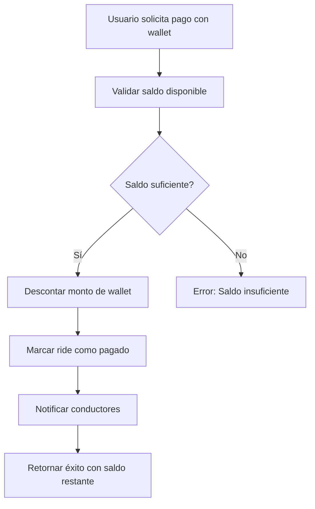

# 💰 Sistema de Pagos con Wallet - Uber Clone

## 📋 **Resumen Ejecutivo**

El sistema de pagos con Wallet permite a los usuarios pagar viajes directamente desde su saldo disponible en la aplicación, ofreciendo una experiencia de pago instantáneo y sin fricciones.

---

## 🎯 **Características del Sistema**

### **✅ Funcionalidades Implementadas**
- ✅ **Pago instantáneo** desde saldo de wallet
- ✅ **Validación automática** de fondos suficientes
- ✅ **Transacciones seguras** con registro completo
- ✅ **Notificación automática** de conductores tras pago
- ✅ **Integración completa** con sistema de pagos múltiples
- ✅ **Manejo de errores** robusto y user-friendly

### **🔒 Seguridad y Validación**
- ✅ **Verificación de saldo** antes de procesar pago
- ✅ **Transacciones atómicas** (todo o nada)
- ✅ **Auditoría completa** de todas las transacciones
- ✅ **Prevención de double-spending**
- ✅ **Validación de usuario** autenticado

---

## 🏗️ **Arquitectura del Sistema**

### **Componentes Principales**

```typescript
🏗️ Arquitectura del Sistema Wallet:
├── 💰 WalletService              # Gestión de saldos y transacciones
├── 💳 PaymentsService            # Procesamiento de pagos con wallet
├── 🛣️ TransportClientController  # Endpoints de pago para usuarios
├── 📊 Wallet DTOs                # Validación de datos
└── 🗄️ Database Models            # Wallet, WalletTransaction
```

### **Flujo de Datos**



---

## 📊 **Modelos de Base de Datos**

### **Wallet Model**
```prisma
model Wallet {
  id        Int      @id @default(autoincrement())
  userId    Int      @unique @map("user_id")
  balance   Decimal  @default(0.00) @db.Decimal(10, 2)
  createdAt DateTime @default(now()) @map("created_at")
  updatedAt DateTime @default(now()) @updatedAt @map("updated_at")

  // Relations
  user               User                @relation(fields: [userId], references: [id], onDelete: Cascade)
  walletTransactions WalletTransaction[]

  @@map("wallets")
}
```

### **WalletTransaction Model**
```prisma
model WalletTransaction {
  id              Int      @id @default(autoincrement())
  walletId        Int      @map("wallet_id")
  amount          Decimal  @db.Decimal(10, 2)
  transactionType String   @map("transaction_type") // 'credit', 'debit'
  description     String?
  referenceType   String?  @map("reference_type") // 'ride', 'delivery', etc.
  referenceId     String?  @map("reference_id")
  createdAt       DateTime @default(now()) @map("created_at")

  // Relations
  wallet Wallet @relation(fields: [walletId], references: [id], onDelete: Cascade)

  @@map("wallet_transactions")
}
```

---

## 🚀 **API Endpoints**

### **POST /rides/flow/client/transport/:rideId/pay-with-multiple-methods**

**¿Cuándo usar?**
- ✅ Para pagos que incluyen wallet como método de pago
- ✅ Para pagos combinados (ej: wallet + efectivo)
- ✅ Para el flujo principal de pagos múltiples

**Request Body (Pago solo con wallet):**
```typescript
{
  "totalAmount": 25.5,
  "payments": [
    {
      "method": "wallet",
      "amount": 25.5
    }
  ]
}
```

**Request Body (Pago combinado):**
```typescript
{
  "totalAmount": 75.5,
  "payments": [
    {
      "method": "wallet",
      "amount": 50.0
    },
    {
      "method": "cash",
      "amount": 25.5
    }
  ]
}
```

**Response Exitosa:**
```typescript
{
  "data": {
    "rideId": 123,
    "totalAmount": 25.5,
    "paymentMethods": ["wallet"],
    "status": "complete",
    "message": "Pago con wallet procesado exitosamente",
    "walletBalance": 124.75,  // Saldo restante después del pago
    "transactionId": "WALLET-1703123456789-123"
  }
}
```

**Response Error (Saldo insuficiente):**
```typescript
{
  "statusCode": 409,
  "error": "WALLET_PAYMENT_FAILED",
  "message": "Saldo insuficiente. Disponible: 10.00 VES, requerido: 25.50 VES"
}
```

---

## 💡 **Métodos del Servicio**

### **WalletService.deductFunds()**
```typescript
async deductFunds(
  userId: number,
  amount: number,
  description: string
): Promise<Wallet>
```

**Propósito:** Descuenta fondos del wallet del usuario.

**Parámetros:**
- `userId`: ID del usuario
- `amount`: Monto a descontar
- `description`: Descripción de la transacción

**Retorna:** Wallet actualizado con nuevo balance

### **PaymentsService.processWalletPayment()**
```typescript
async processWalletPayment(
  userId: number,
  amount: number,
  serviceType: string,
  serviceId: number
): Promise<{ success: boolean; walletBalance: number; transactionId?: string }>
```

**Propósito:** Procesa un pago completo usando wallet.

**Parámetros:**
- `userId`: ID del usuario que paga
- `amount`: Monto del pago
- `serviceType`: Tipo de servicio ('ride', 'delivery', etc.)
- `serviceId`: ID del servicio específico

**Retorna:**
- `success`: Indica si el pago fue exitoso
- `walletBalance`: Saldo restante en wallet
- `transactionId`: ID único de la transacción

---

## 🔄 **Flujo Completo de Pago con Wallet**

### **1. Validación de Saldo**
```typescript
const walletData = await walletService.getUserWallet(userId);
if (!walletData.wallet) {
  throw new Error('Usuario no tiene wallet activa');
}

const currentBalance = Number(walletData.wallet.balance);
if (currentBalance < amount) {
  throw new Error(`Saldo insuficiente. Disponible: ${currentBalance} VES, requerido: ${amount} VES`);
}
```

### **2. Procesamiento del Pago**
```typescript
// Descontar el monto
const updatedWallet = await walletService.deductFunds(
  userId,
  amount,
  `Pago de ride #${rideId}`
);

// Confirmar el ride como pagado
await ridesFlowService.confirmTransportPayment(rideId, 'wallet');

// Notificar conductores
await ridesFlowService.notifyDriversAfterPayment(rideId);
```

### **3. Registro de Transacción**
```typescript
// Crear registro en wallet_transactions
await prisma.walletTransaction.create({
  data: {
    walletId: wallet.id,
    amount: -amount,
    transactionType: 'debit',
    description: `Pago de ride #${rideId}`,
    referenceType: 'ride',
    referenceId: rideId.toString(),
  },
});
```

---

## 🎯 **Casos de Uso**

### **Caso 1: Pago Completo con Wallet**
```typescript
// Usuario tiene 100 VES en wallet
// Quiere pagar un ride de 25.50 VES

POST /rides/flow/client/transport/123/pay-with-multiple-methods
{
  "totalAmount": 25.5,
  "payments": [{"method": "wallet", "amount": 25.5}]
}

// Resultado:
// ✅ Ride marcado como pagado
// ✅ Saldo wallet: 74.50 VES
// ✅ Conductores notificados automáticamente
```

### **Caso 2: Pago Combinado**
```typescript
// Usuario tiene 50 VES en wallet
// Quiere pagar un ride de 75.50 VES
// Usa wallet + efectivo

POST /rides/flow/client/transport/123/pay-with-multiple-methods
{
  "totalAmount": 75.5,
  "payments": [
    {"method": "wallet", "amount": 50.0},
    {"method": "cash", "amount": 25.5}
  ]
}

// Resultado:
// ✅ Ride marcado como pagado
// ✅ Saldo wallet: 0.00 VES (usó todo)
// ✅ Parte en efectivo pendiente de conductor
```

### **Caso 3: Saldo Insuficiente**
```typescript
// Usuario tiene 10 VES en wallet
// Quiere pagar un ride de 25.50 VES

POST /rides/flow/client/transport/123/pay-with-multiple-methods
{
  "totalAmount": 25.5,
  "payments": [{"method": "wallet", "amount": 25.5}]
}

// Resultado:
// ❌ Error: Saldo insuficiente
// 💡 Sugerir métodos alternativos
```

---

## 🔧 **Gestión de Wallet**

### **Endpoints de Wallet (Futuro)**

#### **GET /wallet/balance**
Obtener saldo actual del wallet

#### **POST /wallet/add-funds**
Agregar fondos al wallet

#### **GET /wallet/transactions**
Historial de transacciones del wallet

#### **POST /wallet/transfer**
Transferir fondos entre usuarios

---

## 📊 **Métricas y Monitoreo**

### **KPIs a Monitorear**
- ✅ **Tasa de conversión** de pagos con wallet
- ✅ **Valor promedio** de transacciones con wallet
- ✅ **Retención de usuarios** que usan wallet
- ✅ **Tasa de error** en pagos con wallet

### **Logs Importantes**
```typescript
// Éxito de pago
this.logger.log(`✅ Wallet payment successful: ${amount} VES deducted. Balance: ${newBalance} VES`);

// Error de saldo
this.logger.error(`❌ Insufficient wallet balance: available ${currentBalance} VES, required ${amount} VES`);

// Error general
this.logger.error(`❌ Wallet payment failed for user ${userId}:`, error);
```

---

## 🚨 **Manejo de Errores**

### **Códigos de Error Específicos**

| Código | Descripción | Acción Frontend |
|--------|-------------|-----------------|
| `WALLET_NOT_FOUND` | Usuario no tiene wallet | Crear wallet automáticamente |
| `INSUFFICIENT_FUNDS` | Saldo insuficiente | Mostrar saldo disponible + sugerir recarga |
| `WALLET_PAYMENT_FAILED` | Error en procesamiento | Reintentar o usar método alternativo |
| `INVALID_AMOUNT` | Monto inválido | Validar input del usuario |

### **Recuperación de Errores**
```typescript
try {
  const result = await processWalletPayment(userId, amount, serviceType, serviceId);
  return result;
} catch (error) {
  if (error.message.includes('Saldo insuficiente')) {
    // Sugerir métodos alternativos
    showAlternativePaymentMethods();
  } else if (error.message.includes('wallet activa')) {
    // Crear wallet automáticamente
    await createWalletForUser(userId);
    // Reintentar pago
    return await processWalletPayment(userId, amount, serviceType, serviceId);
  } else {
    // Error desconocido
    showGenericError();
  }
}
```

---

## 🔒 **Consideraciones de Seguridad**

### **Validaciones Implementadas**
- ✅ **Autenticación JWT** requerida
- ✅ **Verificación de propiedad** del wallet
- ✅ **Validación de montos** positivos
- ✅ **Prevención de race conditions** con transacciones
- ✅ **Auditoría completa** de todas las operaciones

### **Mejores Prácticas**
- ✅ **Transacciones atómicas** para evitar inconsistencias
- ✅ **Rollback automático** en caso de error
- ✅ **Límite de montos** por transacción
- ✅ **Rate limiting** para prevenir abuso

---

## 🎯 **Beneficios para Usuarios**

### **Para Pasajeros**
- ⚡ **Pago instantáneo** sin esperar confirmaciones bancarias
- 💰 **Ahorro en comisiones** vs métodos tradicionales
- 📱 **Experiencia fluida** dentro de la app
- 🎁 **Posibles recompensas** por usar wallet

### **Para Conductores**
- ✅ **Pagos garantizados** (ya confirmados)
- 🚀 **Asignación más rápida** de viajes
- 📊 **Métricas mejoradas** de aceptación

### **Para la Plataforma**
- 📈 **Mayor conversión** de pagos completados
- 💾 **Reducción de carga** en procesadores externos
- 📊 **Mejor analítica** de comportamiento de usuarios
- 🔄 **Menor fricción** en el funnel de pago

---

## 🚀 **Próximas Expansiones**

### **Funcionalidades Futuras**
- 💳 **Recarga automática** desde tarjetas guardadas
- 🎁 **Programa de recompensas** por uso de wallet
- 📊 **Dashboard de gastos** en wallet
- 🔄 **Transferencias P2P** entre usuarios
- 💰 **Intereses** en saldo no utilizado

### **Integraciones Planeadas**
- 🏦 **Bancos locales** para recargas directas
- 💳 **Tarjetas de crédito** para recargas
- ₿ **Criptomonedas** para recargas avanzadas
- 📱 **Pago móvil** integrado

---

## 📚 **Referencias y Documentación**

### **Archivos de Código Relacionados**
- `src/wallet/wallet.service.ts` - Servicio principal de wallet
- `src/payments/payments.service.ts` - Procesamiento de pagos con wallet
- `src/rides/flow/transport.client.controller.ts` - Endpoints de pago
- `prisma/schema.prisma` - Modelos de base de datos

### **Documentación Relacionada**
- [Sistema de Pagos Completo](./TRANSPORT-FLOWS-DOCUMENTATION.md)
- [API Endpoints Guide](./API-ENDPOINTS-GUIDE.md)
- [Database Schema](./schema.md)

---

## 🎉 **Conclusión**

El sistema de pagos con Wallet representa una **evolución significativa** en la experiencia de pago de la plataforma Uber Clone, ofreciendo:

- ⚡ **Velocidad**: Pagos instantáneos sin esperas
- 🔒 **Seguridad**: Validaciones robustas y auditoría completa
- 💰 **Conveniencia**: Integración perfecta con el flujo existente
- 📈 **Escalabilidad**: Base sólida para futuras expansiones

**¡El sistema está listo para producción y preparado para manejar altos volúmenes de transacciones!** 🚀

---

**Última actualización:** $(date)
**Versión:** v1.0.0
**Autor:** AI Assistant - Sistema de Pagos con Wallet
