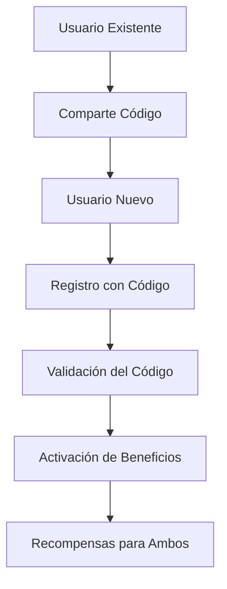

# 🚀 Sistema de Referidos - Documentación Completa

## 📋 Resumen Ejecutivo

Este documento describe el diseño e implementación de un **Sistema de Referidos** para la plataforma Uber Clone, diseñado para aumentar la adquisición de usuarios mediante incentivos mutuos entre referentes y referidos.

---

## 🎯 Objetivos del Sistema

### Objetivos Principales
- **Incrementar adquisición de usuarios**: Atraer nuevos usuarios mediante recompensas
- **Mejorar retención**: Crear engagement continuo a través de beneficios
- **Reducir costo de adquisición**: Convertir usuarios existentes en embajadores de marca
- **Generar crecimiento viral**: Crear un efecto multiplicador en la base de usuarios

### Métricas Esperadas
- **25-40%** aumento en registro de nuevos usuarios
- **15-25%** reducción en costo por adquisición
- **30%** mejora en retención de usuarios
- **ROI del 300-500%** en el primer año

---

## 🏗️ Arquitectura del Sistema

### Componentes Principales

#### 1. **Códigos de Referido**
- **Formato**: Alfanumérico único (ej: `UBER123ABC`)
- **Generación**: Automática al registro del usuario
- **Longitud**: 8-12 caracteres para facilitar sharing
- **Validación**: Verificación en tiempo real

#### 2. **Flujo de Referido**


#### 3. **Sistema de Recompensas**
- **Para el Referente**: Créditos en wallet, descuentos, viajes gratis
- **Para el Referido**: Créditos iniciales, descuentos en primeros viajes
- **Tiers de Recompensa**: Diferentes niveles según volumen de referidos

---

## 💰 Estructura de Recompensas

### Recompensas para Referentes

#### Tier Básico (1-5 referidos)
- **Primer referido**: $5 USD en créditos
- **Segundo referido**: $3 USD en créditos
- **Tercer referido**: Viaje gratis (hasta $10)
- **Cuarto-Quinto**: $2 USD cada uno

#### Tier Avanzado (6-20 referidos)
- **Sexto-Decimo**: $4 USD por referido
- **Undécimo-Vigésimo**: $6 USD por referido + 1 viaje gratis cada 5 referidos

#### Tier VIP (21+ referidos)
- **Veintiuno en adelante**: $8 USD por referido
- **Bonos mensuales**: Créditos adicionales por mantenimiento de referidos activos

### Recompensas para Referidos

#### Beneficios Iniciales
- **$10 USD** en créditos al completar primer viaje
- **Descuento del 20%** en primeros 3 viajes
- **Viaje gratis** si el referente tiene tier VIP

#### Beneficios Continuos
- **Descuentos exclusivos** en promociones
- **Prioridad** en matching durante horas pico
- **Acceso anticipado** a nuevas funcionalidades

---

## 🎨 Experiencia de Usuario

### Interfaz de Usuario

#### 1. **Dashboard de Referidos**
```
┌─────────────────────────────────────────┐
│           MIS REFERIDOS                 │
├─────────────────────────────────────────┤
│ Código: UBER123ABC                     │
│ Enlace: uber-clone.com/ref/UBER123ABC  │
├─────────────────────────────────────────┤
│ 👥 Referidos Totales: 3                 │
│ 💰 Ganancias Totales: $12.00           │
│ ⭐ Nivel Actual: Básico                 │
├─────────────────────────────────────────┤
│ 📊 Historial de Referidos               │
│ • Juan Pérez - $5.00 (Completado)       │
│ • María García - $3.00 (Pendiente)      │
│ • Carlos López - $2.00 (Activo)         │
├─────────────────────────────────────────┤
│ 🎁 Próxima Recompensa: Viaje Gratis     │
│ 🔗 Compartir Código                     │
└─────────────────────────────────────────┘
```

#### 2. **Opciones de Compartir**
- **Copiar enlace**: URL corta con código embebido
- **Redes sociales**: Integración con WhatsApp, Facebook, Twitter
- **Mensaje personalizado**: Templates predefinidos
- **Código QR**: Para compartir físico

### Flujo de Onboarding para Nuevos Usuarios

#### Paso 1: Registro
- Campo opcional "Código de referido"
- Validación automática del código
- Mensaje de confirmación

#### Paso 2: Primer Viaje
- Notificación de beneficios activados
- Créditos aplicados automáticamente
- Recordatorio de compartir código propio

---

## 🔧 Funcionalidades Técnicas

### Gestión de Códigos

#### Generación Automática
- **Algoritmo**: Combinación de timestamp + hash del user ID
- **Unicidad**: Validación contra base de datos
- **Formato**: Mayúsculas + números, sin caracteres confusos (0/O, I/l)

#### Validación de Códigos
- **Tiempo real**: Validación durante registro
- **Case insensitive**: Flexibilidad en ingreso
- **Prevención de fraude**: Límite de usos por código

### Sistema de Recompensas

#### Activación Automática
- **Trigger events**: Primer viaje completado del referido
- **Cálculo dinámico**: Basado en tier del referente
- **Aplicación inmediata**: Créditos disponibles al instante

#### Gestión de Tiers
- **Actualización automática**: Al alcanzar umbrales
- **Retroactividad**: Bonos por referidos históricos
- **Mantenimiento**: Requisitos de actividad mensual

### Análisis y Reportes

#### Métricas Principales
- **Conversión de referidos**: % que completan registro
- **Activación**: % que completan primer viaje
- **Valor Lifetime**: Ingresos generados por referido
- **ROI por canal**: Efectividad de diferentes métodos de sharing

#### Dashboard Administrativo
- **Vista general**: Métricas globales del sistema
- **Análisis por usuario**: Performance de referentes top
- **Tendencias**: Crecimiento mensual de la red
- **Alertas**: Detección de uso fraudulento

---

## 🔒 Consideraciones de Seguridad

### Prevención de Fraude

#### Detección de Patrones Sospechosos
- **Múltiples registros**: Desde misma IP/dispositivo
- **Referidos inactivos**: Códigos compartidos masivamente sin conversión
- **Abuso de sistema**: Intentos de gaming del sistema de recompensas

#### Medidas de Seguridad
- **Rate limiting**: Límite de referidos por día/usuario
- **Verificación de identidad**: Requerir verificación para grandes recompensas
- **Auditoría**: Logs detallados de todas las transacciones

### Protección de Datos
- **Anonimización**: No compartir datos personales entre referente/referido
- **Consentimiento**: Aprobación explícita para participación
- **Derecho al olvido**: Capacidad de eliminar referencias

---

## 📊 Estrategia de Marketing

### Campañas de Lanzamiento

#### Fase 1: Beta Testing (Semanas 1-2)
- **Audiencia**: Usuarios existentes más activos
- **Incentivo**: Recompensas dobles por tiempo limitado
- **Comunicación**: Email + push notifications + in-app banners

#### Fase 2: Lanzamiento General (Semanas 3-4)
- **Audiencia**: Toda la base de usuarios
- **Incentivo**: Recompensas estándar + concursos
- **Canales**: Redes sociales + partnerships

#### Fase 3: Optimización Continua (Mes 2+)
- **A/B Testing**: Diferentes estructuras de recompensa
- **Segmentación**: Campañas específicas por región/demografía
- **Referral loops**: Sistema de referidos de segundo nivel

### Canales de Distribución

#### Digital
- **Redes sociales**: Compartir nativo en plataformas
- **Mensajería**: WhatsApp, Telegram, SMS
- **Email marketing**: Campañas automatizadas
- **Influencers**: Partnership con micro-influencers locales

#### Offline
- **Códigos QR**: En vehículos, tiendas físicas
- **Flyers**: En puntos de alta densidad de usuarios
- **Eventos**: Demo days y lanzamientos locales

---

## 💡 Casos de Uso y Ejemplos

### Caso 1: Usuario Urbano Activo
**Perfil**: Profesional de 25-35 años, usa la app 3-5 veces por semana

**Flujo Típico**:
1. Recibe notificación del lanzamiento del sistema
2. Comparte código con 2-3 amigos cercanos
3. Amigos se registran y hacen primeros viajes
4. Recibe $11 en créditos + 1 viaje gratis
5. Se motiva a compartir con más contactos

**Resultado Esperado**: 5-8 referidos en primer mes, convirtiéndose en referente top

### Caso 2: Conductor que Recomienda
**Perfil**: Conductor establecido con buena reputación

**Flujo Típico**:
1. Comparte código con familiares/amigos interesados en conducir
2. Nuevos conductores se registran usando el código
3. Ambos reciben beneficios al completar primeros viajes
4. Crea red de conductores relacionados

**Beneficio Adicional**: Mejora la disponibilidad de conductores en zonas específicas

### Caso 3: Usuario Casual
**Perfil**: Usuario ocasional, 1-2 viajes por mes

**Flujo Típico**:
1. Recibe código de referido de amigo cercano
2. Se registra con descuento en primeros viajes
3. Descubre beneficios del programa
4. Se convierte en referente activo

---

## 📈 Métricas de Éxito y KPIs

### KPIs Principales

#### Adquisición de Usuarios
- **Tasa de Conversión de Referidos**: % de códigos compartidos que resultan en registro
- **Velocidad de Adquisición**: Nuevos usuarios por semana
- **Costo por Adquisición**: Comparación pre/post implementación

#### Engagement y Retención
- **Tasa de Activación**: % de referidos que completan primer viaje
- **Tasa de Referencia**: Promedio de códigos compartidos por usuario
- **Retención de Referentes**: % que siguen activos después de 3 meses

#### Financiero
- **ROI del Sistema**: Ingresos generados vs costos de recompensas
- **Valor Lifetime por Referido**: Ingresos promedio generados
- **Payback Period**: Tiempo para recuperar inversión inicial

### Dashboard de Métricas

#### Vista General
```
📊 SISTEMA DE REFERIDOS - MÉTRICAS SEMANALES

👥 Adquisición de Usuarios
├── Nuevos usuarios: 1,247 (+23% vs semana anterior)
├── Por referidos: 423 (34% del total)
└── Tasa conversión: 12.7%

💰 Rendimiento Financiero
├── Ingresos generados: $8,432
├── Costos recompensas: $2,156
├── ROI: 292%
└── Valor promedio por referido: $19.92

🎯 Engagement
├── Códigos compartidos: 3,421
├── Referentes activos: 892
└── Tier distribution: Básico 68%, Avanzado 24%, VIP 8%
```

---

## 🚀 Plan de Implementación

### Fase 1: Diseño y Desarrollo (2-3 semanas)
- [ ] Diseño de base de datos y APIs
- [ ] Desarrollo de lógica de recompensas
- [ ] Creación de interfaces de usuario
- [ ] Sistema de validación y seguridad

### Fase 2: Testing y QA (1 semana)
- [ ] Pruebas unitarias e integración
- [ ] Testing de casos edge y seguridad
- [ ] Beta testing con usuarios seleccionados
- [ ] Optimización de performance

### Fase 3: Lanzamiento (1 semana)
- [ ] Deploy gradual por región
- [ ] Campaña de lanzamiento
- [ ] Monitoreo continuo
- [ ] Soporte técnico

### Fase 4: Optimización Continua (Mes 2+)
- [ ] Análisis de métricas
- [ ] Ajustes en estructura de recompensas
- [ ] Nuevas funcionalidades basadas en feedback
- [ ] Expansión a nuevos mercados

---

## 💰 Análisis de Costos y Beneficios

### Costos Iniciales (Primer Mes)
- **Desarrollo**: $15,000 - $25,000
- **Diseño UI/UX**: $5,000 - $8,000
- **Marketing lanzamiento**: $3,000 - $5,000
- **Total**: $23,000 - $38,000

### Costos Operativos Mensuales
- **Recompensas**: $2,000 - $5,000 (dependiendo del volumen)
- **Servicios de terceros**: $500 (analytics, email marketing)
- **Mantenimiento**: $1,000
- **Total**: $3,500 - $6,500/mes

### Beneficios Esperados

#### Año 1
- **Ingresos adicionales**: $150,000 - $300,000
- **Reducción CAC**: 20-30%
- **Aumento base usuarios**: 40-60%
- **ROI**: 300-500%

#### Año 2+
- **Crecimiento orgánico**: 25% mensual sostenible
- **Reducción dependencia marketing**: 40%
- **Valor de marca**: Incremento significativo
- **Competitive advantage**: Diferenciación en el mercado

### Break-even Analysis
- **Punto de equilibrio**: 3-4 meses
- **ROI positivo**: Desde mes 4
- **Escalabilidad**: Costos marginales bajos por usuario adicional

---

## ⚖️ Consideraciones Legales y Regulatorias

### Aspectos Legales Principales

#### Protección de Datos
- **Compliance GDPR/CCPA**: Consentimiento explícito requerido
- **Anonimización**: No compartir datos personales
- **Derecho de eliminación**: Usuarios pueden eliminar su participación

#### Regulaciones Financieras
- **AML/KYC**: Verificación para recompensas grandes
- **Reportes fiscales**: Declaración de ingresos por referidos
- **Transparencia**: Términos claros sobre el programa

#### Términos y Condiciones
- **Reglas claras**: Condiciones para participar y recibir recompensas
- **Derecho de modificación**: Capacidad de cambiar términos con aviso
- **Resolución de disputas**: Proceso para resolver conflictos

### Riesgos y Mitigaciones

#### Riesgo de Fraude
- **Mitigación**: Sistema de detección automática + revisión manual
- **Impacto**: Pérdidas financieras limitadas
- **Plan B**: Suspensión temporal del programa

#### Riesgo Regulatorio
- **Mitigación**: Consultoría legal previa al lanzamiento
- **Compliance**: Auditorías regulares
- **Actualización**: Monitoreo de cambios regulatorios

---

## 🔮 Expansiones Futuras

### Funcionalidades Avanzadas

#### Sistema de Niveles
- **Gamificación**: Logros y badges por hitos alcanzados
- **Concursos**: Competiciones entre referentes
- **Exclusividades**: Beneficios únicos para top referentes

#### Integraciones
- **Redes sociales**: Compartir automático en múltiples plataformas
- **Calendario**: Recordatorios inteligentes de compartir
- **Analytics personal**: Insights sobre performance individual

#### Inteligencia Artificial
- **Recomendaciones**: Sugerir mejores momentos/canales para compartir
- **Predicción**: Identificar usuarios con alto potencial de conversión
- **Personalización**: Recompensas adaptadas al perfil del usuario

### Expansión Geográfica
- **Localización**: Adaptación a regulaciones locales
- **Monedas locales**: Soporte para diferentes divisas
- **Cultural adaptation**: Mensajes y recompensas culturalmente relevantes

---

## 📞 Conclusión y Recomendaciones

### Resumen Ejecutivo
El Sistema de Referidos representa una **oportunidad estratégica** para acelerar el crecimiento de la plataforma Uber Clone, con un **ROI atractivo** y **bajo riesgo de implementación**.

### Recomendaciones Finales

#### Iniciar con MVP
- Comenzar con estructura simple de recompensas
- Enfocarse en usabilidad y experiencia de usuario
- Medir métricas desde el primer día

#### Enfoque en Calidad sobre Cantidad
- Priorizar referidos de alta calidad vs volumen
- Enfatizar la experiencia de los nuevos usuarios
- Construir lealtad a largo plazo

#### Monitoreo Continuo
- Establecer dashboard de métricas desde el inicio
- Realizar ajustes basados en datos reales
- Mantener flexibilidad para optimizaciones

#### Preparación para Escala
- Diseñar arquitectura para crecimiento rápido
- Planificar soporte y moderación
- Considerar internacionalización desde el inicio

---

**📋 Checklist Pre-Lanzamiento**
- [ ] Diseño técnico completo aprobado
- [ ] Equipo de desarrollo asignado
- [ ] Presupuesto aprobado
- [ ] Consultoría legal completada
- [ ] Plan de marketing definido
- [ ] Métricas de éxito establecidas
- [ ] Plan de contingencia preparado

**🎯 Próximos Pasos Recomendados**
1. **Semana 1**: Reunión de kickoff con stakeholders
2. **Semana 2**: Diseño técnico detallado
3. **Semana 3-4**: Desarrollo del MVP
4. **Semana 5**: Testing y QA
5. **Semana 6**: Lanzamiento beta
6. **Semana 7**: Lanzamiento general

---

*Esta documentación proporciona una base sólida para la implementación del Sistema de Referidos. Se recomienda revisarla con el equipo técnico y legal antes de proceder con el desarrollo.*
